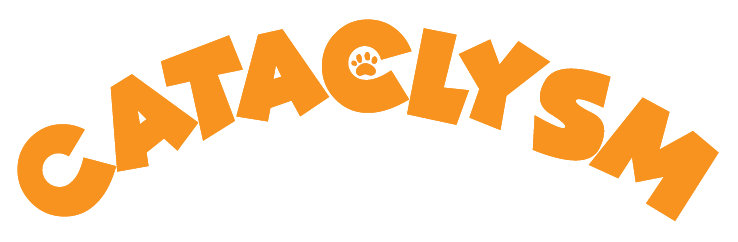

# Cataclysm

## One week game challenge from Becode

>Disclaimer : This is actually an old group project from Becode. I re-uploaded it purely for the fun factor. Enjoy it !

* Projet de groupe avec [Frédérick Van Isschot](https://github.com/Fred-Vaniss), [Joshua Fouyon](https://github.com/fouyonjoshua), [Vincent De Gheyndt](https://github.com/vincentdegheyndt), [Maud Barbier](https://github.com/maudbecode) et [Cindy Buchet](https://github.com/Cindy-Buchet)
* Formation: BeCode
* Du 9 août au 23 août 2019
* Javascript (Phaser)
* Lien de la version jouable: [cataclysm](https://cataclysm.netlify.app/)

## Description du projet
Les coach de BeCode ont organisés un genre de "GameJam" interne, où les apprenants forment des groupes de 5 personnes pour développer un jeu en une semaine.

On pouvait développer ce qu'on voulait, la seule contraite est que le jeu doit être jouable en ligne avec plusieurs personnes.

## Le développement

### L'idée générale du jeu
Avant de commencer, on s'est rassemblé autour d'une table pour savoir ce qu'on allais faire. On a donc décidé de faire un jeu de plateforme assez simple, avec des chats, ou le but serais d'atteindre la fin du niveau en premier en évitant des pièges vicieusement caché avec des bonus et malus sur le terrain.

### Les rôles de l'équipe
* Joshua: l'architecture du jeu et du Netcode.
* Frédérick: le code du jeu ainsi que du design et l'animation du personnage.
* Vincent: Les effets sonores et le code des bonus et éléments interactifs et le level design.
* Maud et Cindy: Les sprites et le level design

### Les difficultés
La grosse difficulté est de développer sur un framework qu'on ne connait pas. Il nous a fallu apprendre sur le tas et on a du faire face à de nombreux problèmes qu'on a eu très dificile à résoudre. On a tout juste réussi a présenter un jeu fonctionnel.

Une autre difficulté aussi est le Netcode qui à été très difficile à mettre en place.

Et il y a  aussi le problème de la puissance de certaines de nos machines qui étaient insufissants pour la charge de travail qu'on à du faire.

## Conclusion
C'était à la fois très intéressant et très compliqué de travailler sur ce projet. Le fait de devoir apprendre pour rendre un projet en une semaine.

On est gagnant à égalité avec un autre groupe, ça à été une bonne expérience pour nous tous.
